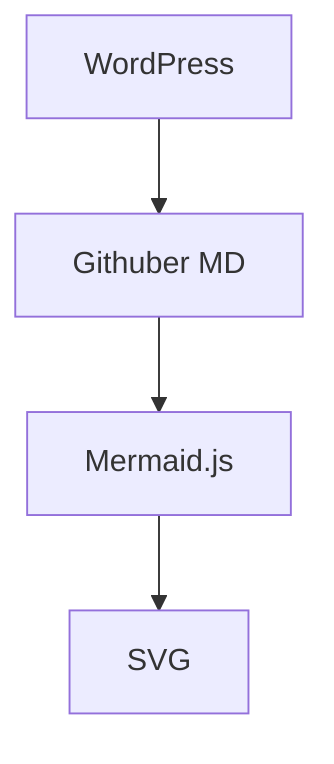

# Babel Arcaea Mermaid

WordPress 插件 —— 在 Sakurairo / Arcaea 风格博客中渲染 Mermaid 图表。

## 特性

- **Markdown 代码块**：自动识别 ```` ```mermaid ```` 并渲染
- **短代码**：`[mermaid]...[/mermaid]`
- **Arcaea 风格**：夜空背景、蓝白辉光、毛玻璃容器
- **双主题**：Arcaea Dark / Arcaea Light，支持跟随系统
- **安全等级可选**：strict / loose / antiscript / sandbox
- **版本锁定**：默认 Mermaid 11.15.0，避免 @latest 破坏
- **后台设置页**：版本、主题、安全等级全可配

## 安装

### 方法 A：Git clone

```bash
cd /var/www/html/wp-content/plugins/
git clone https://github.com/AKCX2002/babel-arcaea-mermaid.git
```

然后后台 → 插件 → 启用。

### 方法 B：zip 上传

```bash
cd /var/www/html/wp-content/plugins/
git clone https://github.com/AKCX2002/babel-arcaea-mermaid.git
zip -r babel-arcaea-mermaid.zip babel-arcaea-mermaid/
```

后台上传 zip 安装。

## 配置

后台 → 设置 → Arcaea Mermaid

| 选项 | 推荐值 |
|------|--------|
| 启用插件 | 开 |
| Mermaid 版本 | 11.15.0 |
| 主题模式 | Arcaea Dark |
| 安全等级 | strict |
| Markdown 代码块 | 开 |
| 短代码 | 开 |
| 发光效果 | 开 |

## 文章写法

````markdown

````

或短代码：

```
[mermaid]
flowchart TD
    A[启动] --> B[初始化]
[/mermaid]
```

## 依赖

- WordPress 5.0+
- Mermaid.js 11.15.0（CDN 加载，无需本地安装）

## License

GPL-2.0-or-later
