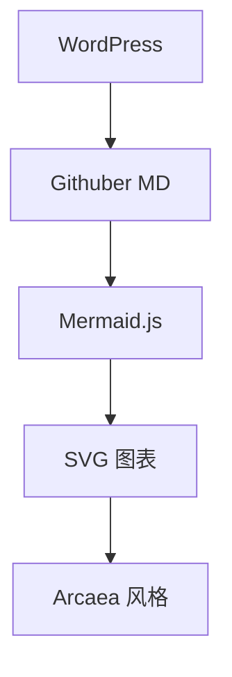
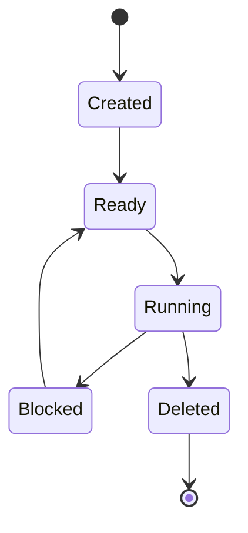
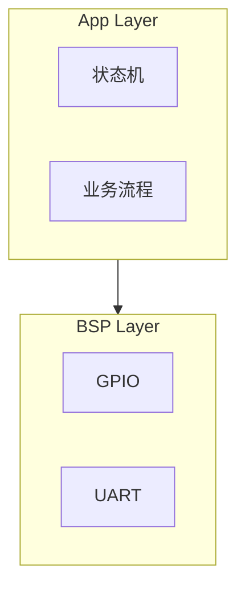

# Babel Arcaea Mermaid

[](LICENSE)
[](https://wordpress.org)
[](https://mermaid.js.org)

> WordPress 插件 —— 在 Sakurairo / Arcaea 风格博客中渲染 Mermaid 图表，  
> 支持 Markdown 代码块和短代码，毛玻璃 + 蓝白辉光视觉。

---

## 特性

- **Markdown 代码块**：自动识别 ` ```mermaid ` 并替换为渲染图表
- **短代码**：`[mermaid]...[/mermaid]`，兼容经典编辑器、区块编辑器、HTML 混排
- **Arcaea 风格**：夜空深色背景、蓝白辉光、毛玻璃容器
- **双主题**：Arcaea Dark / Arcaea Light，支持跟随页面 `data-theme` 属性或系统偏好
- **安全等级**：strict（默认）/ loose / antiscript / sandbox 可选
- **版本锁定**：默认 Mermaid 11.15.0（推荐），可选 10.9.6 LTS
- **后台设置页**：版本选择、主题切换、安全等级、开关控制全可配
- **移动端适配**：768px 断点 + SVG 横滚
- **残障适配**：`prefers-reduced-motion` 禁用动画

## 截图

| Arcaea Dark | Arcaea Light |
|-------------|--------------|
| 夜空深色背景 + 冰蓝辉光 | 浅色半透明玻璃 |
| `#1b2233` + `#8abfff` | `#f7fbff` + `#5c9ee6` |

## 安装

### 方法 A：Git clone（推荐）

```bash
cd /var/www/html/wp-content/plugins/
git clone https://github.com/AKCX2002/babel-arcaea-mermaid.git
```

然后 WordPress 后台 → 插件 → 找到 **Babel Arcaea Mermaid** → 启用。

### 方法 B：Release zip

前往 [Releases](https://github.com/AKCX2002/babel-arcaea-mermaid/releases) 页面下载最新 `babel-arcaea-mermaid.zip`。

WordPress 后台 → 插件 → 安装插件 → 上传插件 → 选择 zip → 安装 → 启用。

## 配置

启用后进入：**设置 → Arcaea Mermaid**

| 选项 | 推荐值 | 说明 |
|------|--------|------|
| 启用插件 | 开 | 总开关 |
| Mermaid 版本 | `11.15.0` | 锁定版本，避免 @latest 破坏 |
| 主题模式 | `Arcaea Dark` | Dark / Light / Auto 跟随页面 |
| 安全等级 | `strict` | 技术博客推荐 strict |
| Markdown 代码块 | 开 | 自动识别 ` ```mermaid ` |
| 短代码 | 开 | 启用 `[mermaid]` |
| 发光效果 | 开 | 容器 hover 时增强蓝白辉光 |

## 使用

### Markdown 代码块（推荐，配合 Githuber MD）

````markdown

````

### 短代码

```
[mermaid]
flowchart TD
    A[启动] --> B[加载 Mermaid]
    B --> C[转换代码块]
    C --> D[渲染图表]
[/mermaid]
```

### 技术博客示例

**FreeRTOS 状态图：**

````markdown

````

**BSP / Server / App 分层：**

````markdown

````

## 工作原理

```
WordPress 页面加载
  ↓
babel-arcaea-mermaid.php
  → 注入 arcaea-mermaid.css（玻璃容器样式）
  → 注入 arcaea-mermaid.js（渲染引擎）
  ↓
arcaea-mermaid.js
  → convertCodeBlocks()：将 <pre><code class="language-mermaid"> 替换为 <div class="bam-mermaid-wrap">
  → markContainers()：将裸 .mermaid 元素包裹进玻璃容器
  → 动态 import mermaid@11.15.0 ESM
  → mermaid.initialize({ theme: "base", themeVariables: {Arcaea配色} })
  → mermaid.run({ querySelector: ".mermaid" })
  ↓
SVG 图表 → 蓝白辉光标框内的毛玻璃卡片
```

## Mermaid 版本策略

| 版本 | 说明 |
|------|------|
| `11.15.0` | 推荐。2025-2026 年稳定版，含安全修复和样式清洗 |
| `11` | 11.x 最新主版本，自动跟随 |
| `10.9.6` | 10.x LTS 风格，兼容旧项目 |

用 `theme: "base"` + `themeVariables` 而非预设 dark/neutral 主题，
确保 Arcaea 配色精确控制且不受上游主题重构影响。

## CSS 架构

```css
.bam-mermaid-wrap       /* 发光渐变边框容器 */
  └─ ::before           /* 环境光晕叠加层 */
  └─ .bam-mermaid-diagram /* 毛玻璃卡片 + 图表 SVG */
```

关键 CSS 值：
- 容器圆角：18px
- 卡片背景：`rgba(20, 25, 38, 0.78)` 半透明深空蓝
- 玻璃效果：`backdrop-filter: blur(16px) saturate(1.25)`
- 辉光：`box-shadow: 0 0 26px rgba(109, 173, 255, 0.18)`
- 文本：`#eaf4ff` 冰蓝
- 字体：`FiraCode Nerd Font` > `Noto Sans SC`

## 开发

```bash
git clone https://github.com/AKCX2002/babel-arcaea-mermaid.git
cd babel-arcaea-mermaid
# 修改插件后更新版本号
sed -i 's/Version: 1.0.0/Version: 1.0.1/' babel-arcaea-mermaid.php
git add -A
git commit -m "bump: 1.0.1"
git push
# GitHub Actions 自动构建 release
```

## Changelog

### 1.0.0
- 初始版本
- Markdown 代码块自动检测
- 短代码 `[mermaid]` 支持
- Arcaea Dark / Light 双主题
- `mermaid.run()` + `theme: "base"` + `themeVariables`
- 后台设置页
- 移动端适配 + reduced-motion
- GitHub Actions 自动 release

## License

GNU General Public License v2.0 or later

---

Built for [babel36acl.xyz](https://babel36acl.xyz)
